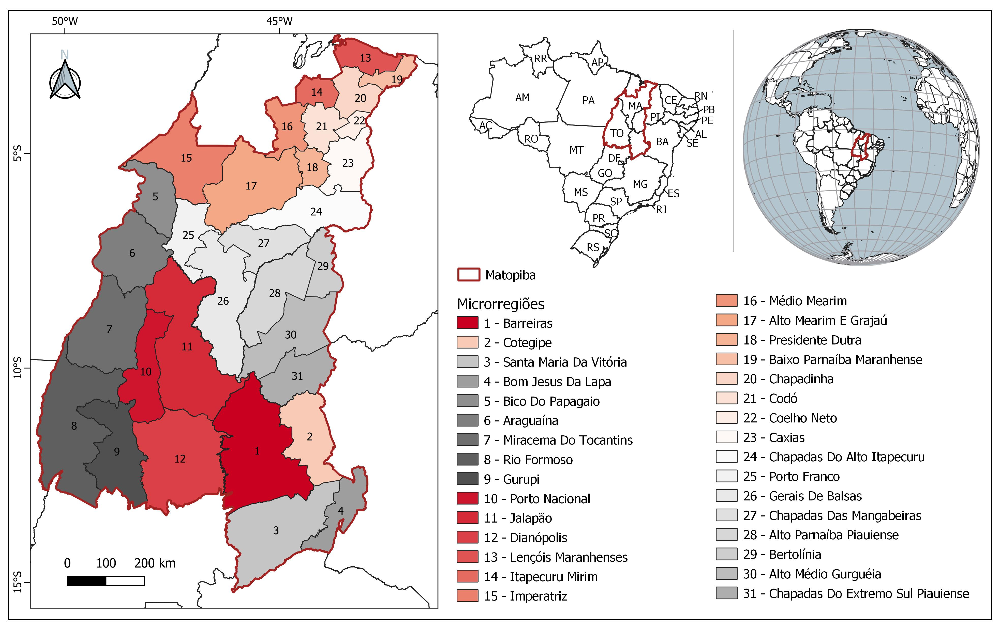

---
output:
  html_document: default
  pdf_document: default
---
# Sobre esse painel

A ocorrência de queimadas e incêndios florestais causam impactos ambientais, sociais e econômicos. Saber onde as queimadas ocorrem  é útil para criar planos de ação de prevenção de controle, principalmente em regiões onde ela é frequente. 

Nos últimos anos, a ocorrência de queimadas tem sido frequente na região do Matopiba, sendo o local de maior área queimada no bioma Cerrado.

Nesse contexto, o objetivo desse painel é apresentar uma visualização dos dados de ocorrência de focos de queimadas, no período de  2011 a 2021, nas microrregiões do Matopiba. 

## Região do Matopiba 

O Matopiba é uma região formada pelo Estado do Tocantins e parte dos Estados do Maranhão, Piauí e Bahia. A região é considerada uma fronteira agrícola e seu nome é um acrônimo formado com as iniciais dos nomes dos estados que a compõe.
&nbsp;

{ width=50% }

&nbsp;
Mapa de localização do Matopiba e das microrregiões. Fonte dos dados dos limites estaduais e das microrregiões: IBGE (2019).

## Dados de focos de queimadas

Para construção do painel foram utilizados dados de focos de queimadas que são indicativos para fogo ativo. Os dados foram obtidos na plataforma do [Programa Queimadas/INPE](https://queimadas.dgi.inpe.br/) para o período de 2011 a 2021. Foram considerados somente os focos obtidos do satelite de referência, indicado para análises temporais.

